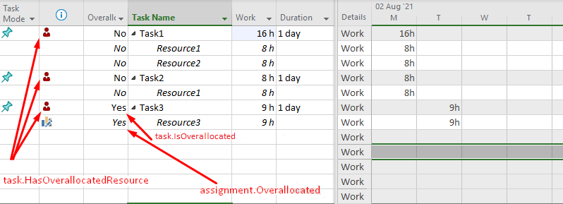

{} 

This page contains release notes for [Aspose.Tasks Cloud 21.8](https://products.aspose.cloud/tasks/cloud).

{} 

## **All Changes**

|**Key**|**Summary**|**Issue Type**|
| :- | :- | :- |
| TASKSNET-10279 | Fix wrong Timephased Data for the material resource in MPP | Bug |
| TASKSNET-10275 | Fix Invalid Tsk.Id when blank line is inserted | Bug |
| TASKSNET-10276 | Fix task lines are shown incorrectly when blank line is inserted for MPP 2003 and 2008 | Bug |
| TASKSNET-10307 | Fix "The given key '188744169' was not present in the dictionary." exception when open MPP document | Bug |
| TASKSNET-10306 | Fix "The given key '1680' was not present in the dictionary." exception when open document | Bug |
| TASKSNET-10306 | Fix "The given key '1680' was not present in the dictionary." exception when open document | Bug |
| TASKSNET-10303 | Fix StackOverflowException when creating a Project from Primavera XML | Bug |
| TASKSNET-10286 | Fix Aspose.Tasks Index was outside the bounds of the array | Bug |
| TASKSNET-10284 | Fix TotalSlack not returning the proper values | Bug |
| TASKSNET-10283 | Resource Over Allocation not updated for entire row | Bug |
| TASKSNET-4719 | IsOverallocated flag is True for tasks that are not overallocated for project plans  | Bug |

## **Public API and Backwards Incompatible Changes**

|**The following public enumerations were added:**|**Description**|
| :- | :- |
| Task.HasOverallocatedResource | Indicates whether the task has an resource assigned which has more work on assigned tasks than can be completed within normal working capacity. |

## **Additional notes**

**Related issue: TASKSNET-4719 - IsOverallocated flag is True for tasks that are not overallocated for project plans**

We added new task field Task.HasOverallocatedResource in order to make overallocations-related API more clear.
Sometimes a task can have overallocated resource, but task itself is not overallocated.
Consider the following figure:
Task1, Task2 have overallocated resource "Resource1", but Task1 and Task2 are not overallocated.

Task3 is overallocated because Resource3 have 9h work assigned on 3 August. Obviously, Task3 also has overallocated resource "Resource3".

Prior to 21.8 Aspose.Tasks Cloud set Task.Overallocated for all that kinds of overallocation.
Now Aspose.Tasks Cloud will set the properties in the following way for abovementioned example:


task1.HasOverallocatedResource : true 
task2.HasOverallocatedResource : true
task3.HasOverallocatedResource : true

task1.IsOverallocated : false
task2.IsOverallocated : false
task3.IsOverallocated : true

resource1.Overallocated : true
resource2.Overallocated : false
resource3.Overallocated : true


