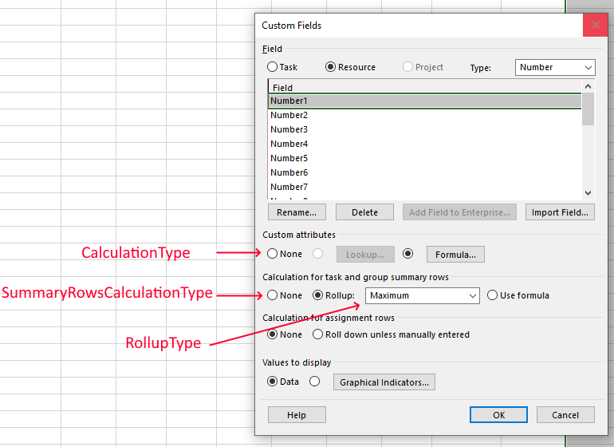

{} 

This page contains release notes for [Aspose.Tasks Cloud 22.7](https://products.aspose.cloud/tasks/cloud).

{} 

## **All Changes**
|**Key**|**Summary**|**Issue Type**|
| :- | :- | :- |
| TASKSNET-2596 | Add support for "Calculation for task and group summary rows" custom field option | Enhancement |
| TASKSNET-10471 | Remove unnecessary memory allocations when reading Task, Assignment, Resource properties | Enhancement |
| TASKSNET-10556 | Add IsRoot property to Resource object | Enhancement |
| TASKSNET-10499 | Fix reading\writing of Guids from\to XER file | Bug |
| TASKSNET-10485 | Fix rendering of holidays in Gantt Chart view | Bug |
| TASKSNET-10484 | Fix reading of Finish Milestones from XER format | Bug |
| TASKSNET-10483 | Fix parsing of formulas with different separators | Bug |
| TASKSNET-10479 | Fix differences of calculated custom fields between versions | Bug |
| TASKSNET-10520 | Fix reading \ writing of PreleveledStart and PreleveledFinish fields | Bug |
| TASKSNET-10519 | Fix task 'Notes' icon is incorrectly shown when MPP saved by Aspose.Tasks is opened using MS Project | Bug |
| TASKSNET-10508 | Fix calculation of formula | Bug |
| TASKSNET-10507 | Fix reading of Activity Codes from XER: some codes are missing | Bug |
| TASKSNET-10497 | Fix calculation of PercentComplete and PercentWorkComplete for tasks read from XER file | Bug |
| TASKSNET-10482 | Fix incorrect Start\Finish dates of task with zero duration | Bug |
| TASKSNET-4691 | Fix incorrect writing of extended attributes for specific version of MPP 2003 format | Bug |
| TASKSNET-10536 | Fix each call to project.Recalculate decreases work of task with 'FixedDuration' Type and non-flat WorkContour | Bug |
| TASKSNET-10524 | Fix infinite loop in recalculations when task calendar is set to 24h | Bug |
| TASKSNET-10505 | Fix incorrect timephased data generation for tasks with non flat WorkContour  | Bug |
| TASKSNET-10554 | Fix incorrect calculation of Asn.Finish for assignments with Asn.Units not equal 1 | Bug |
| TASKSNET-10552 | Fix NullReference exception when reading/writing file with absent "TBknAssn.Props" stream | Bug |
| TASKSNET-10569 | Fix resource rate's RateTo property is set incorrectly when reading project from Primavera P6 XML format | Bug |

## **Public API and Backwards Incompatible Changes**
|**The following public properties were added:**|**Description**|
| :- | :- |
| ExtendedAttributeDefinition.SummaryRowsCalculationType | Specifies the type of a calculation of the custom attribute's value for summary rows. |
| Resource.IsRoot | Gets the flag indicating whether resource is a root resource. |

|**The following public enumerations were added:**|**Description**|
| :- | :- |
| SummaryRowsCalculationType.None | Means the custom attribute's value for summary rows is not calculated. |
| SummaryRowsCalculationType.Rollup | Means the custom attribute's value for summary rows is calculated using rollup function defined in "ExtendedAttributeDefinition.RollupType"|
| SummaryRowsCalculationType.UseFormula | Means the custom attribute's value for summary rows is calculated using formula defined in "ExtendedAttributeDefinition.Formula" />. |

## **Additional notes**
**Related issue: TASKSNET-2596 - Add support for "Calculation for task and group summary rows" custom field option**

The API for Extended attributes were improved. The previous ExtendedAttributeDefinition API where ExtendedAttributeDefinition.CalculationType should be one of the following: { None, Lookup, Rollup, Calculation } didn't reflect all the cases such as extended attribute where values for leaf tasks are calculated using formula and values of the summary tasks are calculated using rollup.
ExtendedAttributeDefinition.SummaryRowsCalculationType property (with values None, Rollup, UseFormula) was added to reflect MS Project's model of extended attribute's settings.
ExtendedAttributeDefinition.CalculationType's values are now limited to (None, Lookup, Formula) values.

